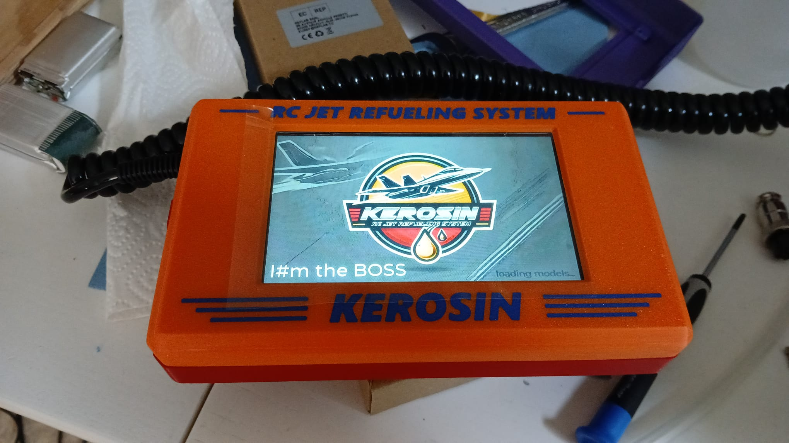
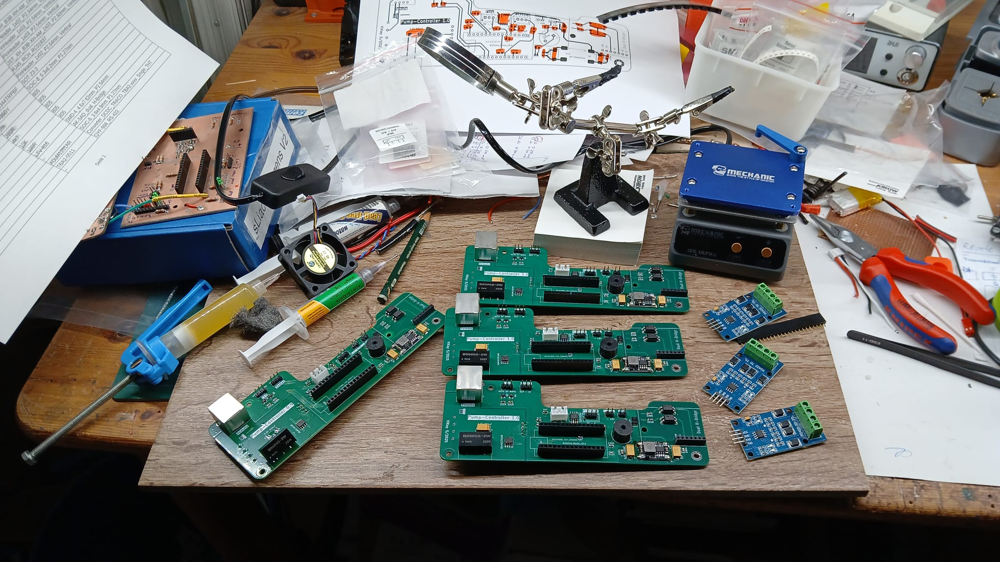
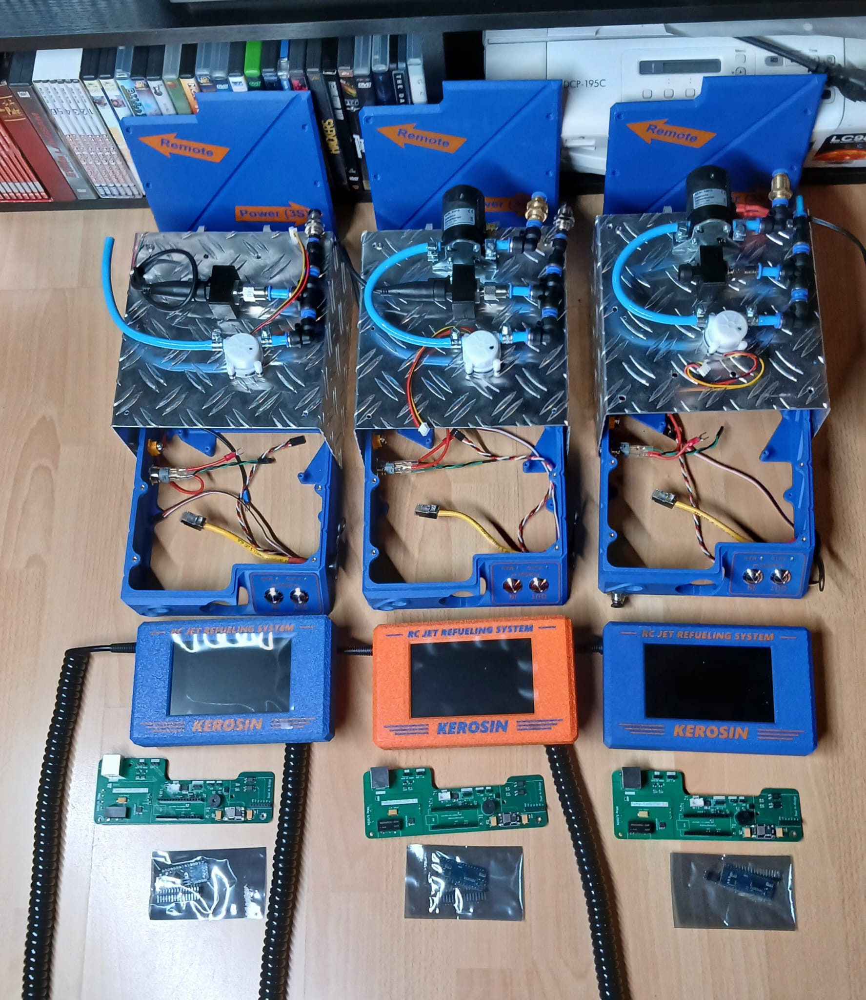

# Kerosin – RC Jet Refueling System

 



---

## ✨ Projektübersicht

**Kerosin – RC Jet Refueling System** ist ein modulares Open-Source-System zur Betankung von Flugmodellen mit Kerosin. Es basiert auf einer Mikrocontroller-Lösung zur Überwachung und Steuerung des Tankvorgangs.

Die Steuerungseinheit ("Controller") befindet sich am Tank. Eine zweite Einheit ("Remote") mit Touchdisplay zeigt Messdaten an und löst Aktionen aus. Die Kommunikation erfolgt über ein RS-422-Kabel.

Ziel ist eine robuste und automatisierte mit komfortabler Bedienung und sicherer Betankung.

---

## 🚀 Features

- **Controller (Arduino Nano)** direkt am Tank
- **Remote (ESP32)** mit Touchdisplay (JC8048W550)
- RS-422 Kommunikation (seriell)
- Automatischer Entleerungsvorgang bei Beuteltanks bei Erreichen des Abschaltdrucks
- Durchflusssensor (YF-S401) zur Kerosinerkennung beim Rückpumpen
- Drucksensor (30 psi, 1/8" NPT) zur Abschaltung
- Konfigurierbare Modelle mit individuell speicherbaren Parametern (Tanktyp, Volumen, Abschaltdruck, usw.)
- Zahnradpumpe für zuverlässige Befüllung und Rückförderung
- 3D-druckbare Komponenten & KiCad-Platinenlayout

---

## ToDo

- Be/Enttankung bei Erreichen der Abschaltzeit beenden (Prio: nice to have)
- Versionsinformationen von Controller und Remote am Touchdisplay mit anzeigen (Prio: nice to have)
- OTA Möglichkeit hinzufügen (Prio: nice to have)
- Backup für Modelle und alle anderen json-Daten der Remote (Prio: nice to have)

---

## 📂 Projektstruktur

```
.
├── software/         # PlatformIO Projekte
│   ├── sTankTeil_Controller/   # Arduino Nano Code
│   └── sTankTeil_Remote/       # ESP32 Touchdisplay
├── kicad/            # KiCad-Schaltplan & Platine
├── 3d/               # 3D-Druckteile (STL, STEP)
├── LICENSE           # GPLv3 Lizenz
└── README.md         # Dieses Dokument
```

---

## 🧱 Komponenten

| Komponente       | Beschreibung                            |
| ---------------- | --------------------------------------- |
| Arduino Nano     | Hauptsteuerung (am Tank)                |
| ESP32            | Remote-Display (JC8048W550)             |
| RS-422 Treiber   | Serielle Verbindung Controller ⇄ Remote |
| Drucksensor      | 30psi Sensor mit 1/8" NPT Gewinde       |
| Durchflusssensor | YF-S401 zur Kerosinerkennung            |
| Zahnradpumpe     | Elektronisch gesteuert, rückförderfähig |

---

## 🔌 Hardwareaufbau

**Controller** ist direkt am Tank montiert und steuert:

- Drucksensor
- Durchflusssensor
- Zahnradpumpe

**Remote** zeigt Live-Daten über ein kapazitives 5.5" Touchdisplay an und erlaubt:

- Auswahl von Modellspeichern
- Anzeige von Druck, Durchfluss und der Menge des aktuellen Tankvorgangs
- Manuelle Aktionen und Steuerung

Verbindung erfolgt über abgeschirmtes RS-422-Kabel mit serieller Kommunikation.

---

## 📜 Lizenz

Dieses Projekt steht unter der [GNU General Public License v3.0](LICENSE). Jede Quellcodedatei enthält einen entsprechenden Lizenz-Header.

---

## 🤝 Mitmachen & Entwicklung

Pull Requests, Verbesserungsvorschläge oder Erweiterungen sind willkommen. Bei Fragen oder Problemen bitte [Issues](https://github.com/V0giK/kerosin/issues) verwenden.

---

## 🌍 Autor / Projekt

Entwickelt von [V0giK](https://github.com/V0giK) für RC-Tank- & Kerosinsysteme.

---

> „This is not just fuel transfer – it's controlled refueling.“

---





während des bastelns ... https://youtube.com/shorts/paOjxJlpqOs
